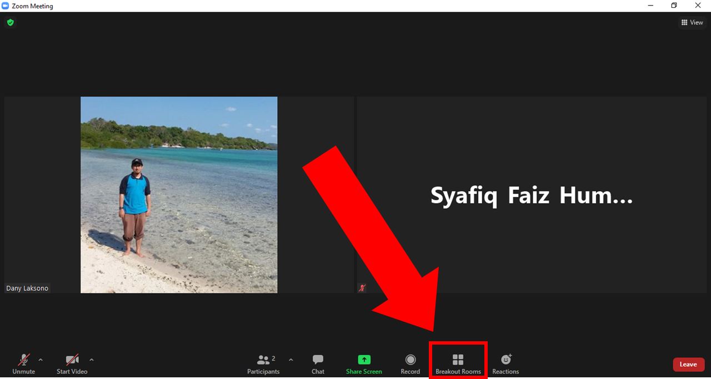
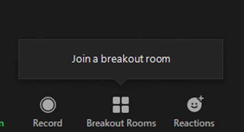
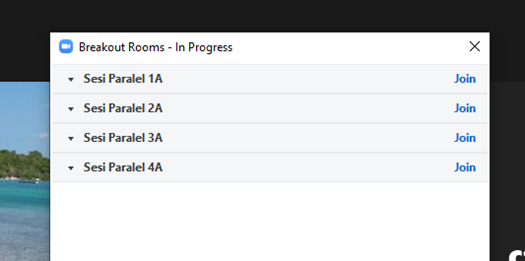
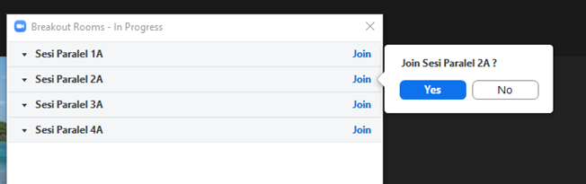
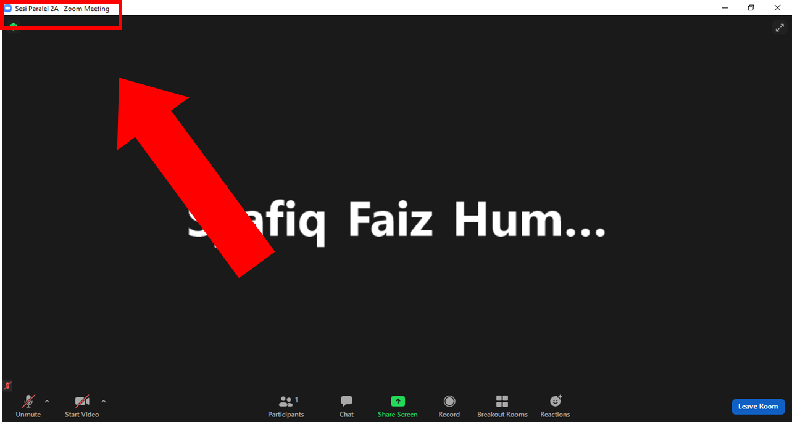
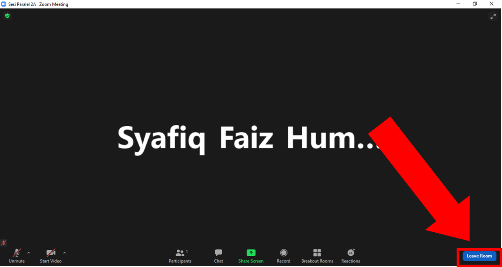
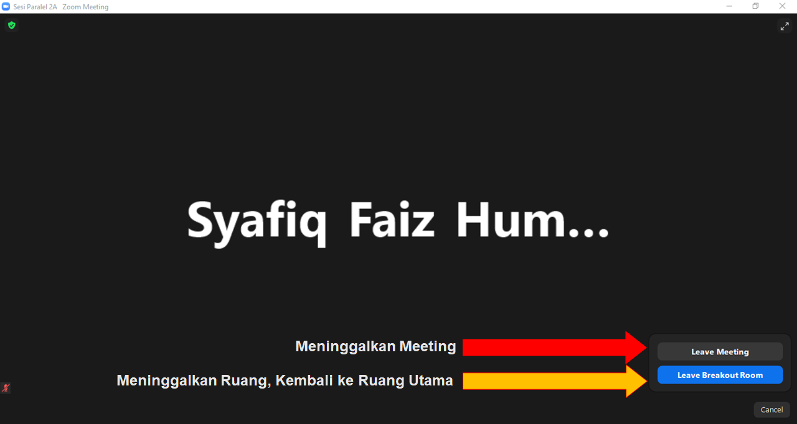

# Panduan Breakout Room menggunakan Zoom

Berikut adalah panduan ringkas mengenai bagaimana Anda dapat menggunakan *breakout room* untuk bergabung dengan Ruang Presentasi yang Anda pilih pada Simposium Infrastruktur Informasi Geospasial (SIIG 2021).

### Bergabung dengan Ruang pada Sesi Parallel

Ikuti langkah berikut untuk bergabung dengan ruang presentasi pilihan Anda pada sesi paralel:

1. Pada jendela Zoom Meeting Anda, klik pada menu `Breakout Room`  di bagian bawah layar

   

2. Penanda semacam ini akan muncul ketika Breakout Room diaktifkan. Anda dapat mulai memasuki ruangan ketika menu ini muncul.

   

3. Akan muncul jendela **Breakout Rooms**. Pilih ruang yang akan Anda masuki dengan mengklik tombol `Join`.

   

4. Jika muncul pertanyaan seperti berikut, pilih `Yes` untuk masuk ke dalam ruang tersebut

   

   

5. Anda dapat melihat ruang sesi paralel yang Anda masuki pada nama jendela di bagian kiri atas

   

### Meninggalkan Ruang Parallel

Langkah berikut digunakan untuk keluar dari ruang parallel atau dari Zoom Meeting

1. Pada jendela sesi parallel Anda, tekan tombol `Leave Room` untuk meninggalkan ruangan

   

2. Klik pada tombol `Leave Breakout Room` untuk meninggalkan ruang presentasi dan kembali ke ruang utama, atau klik pada tombol `Leave Meeting` untuk meninggalkan seminar dan keluar dari Zoom.

   

